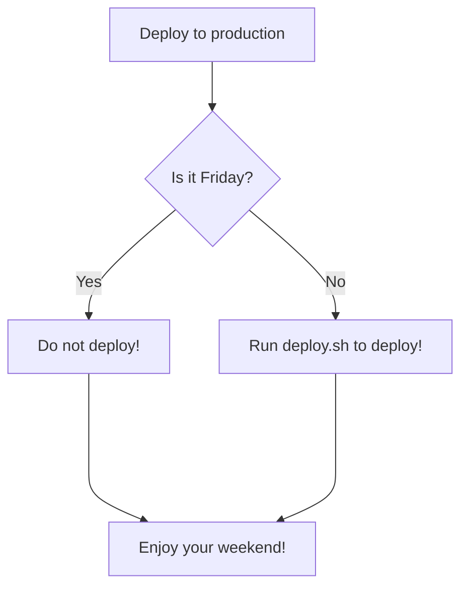

---
---

## Where to Get Help

If you think you've found a bug in the library, please
[check the existing issues](https://github.com/leakyabstractions/result/issues), and if no one has reported the problem,
[open a new issue](https://github.com/leakyabstractions/result/issues/new).

If you have a general question about the library, or how to use it you can
[send me a message on Twitter](https://twitter.com/gcalvo) or
[drop me an email](mailto:leakyabstractions@guillermo.dev).

---

{: #navigation}
- [Basic Usage](SUPPORT.html){: #prev}
- [Advanced Usage](SUPPORT.html){: #next}
